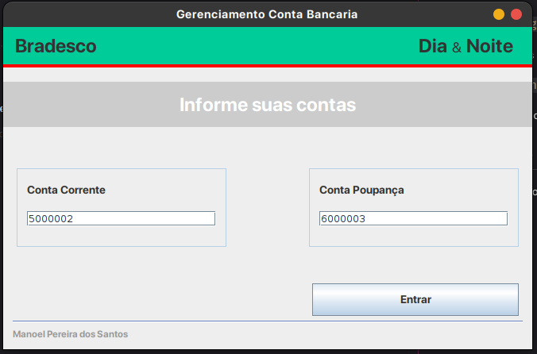
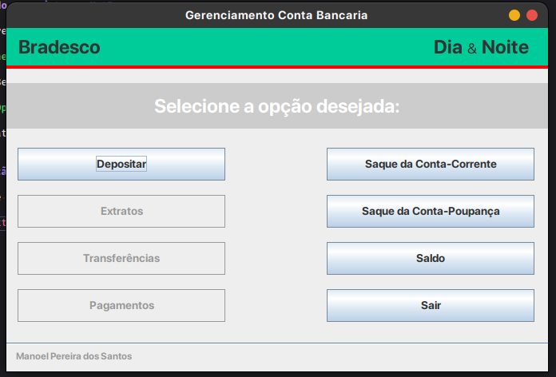

# gerenciamento-bancario-java

Projeto criado em [JAVA](https://java.com/).

Projeto para gerenciamento bancário (Conta corrente e poupança, Deposito, Saque, Juros, Taxas).

Disciplina: Projeto Integrador III-A (10701620005_20241_01)

## abrindo o projeto no NetBeans

Em um diretório de sua preferência, execute para clonar o projeto:

`git clone git@github.com:manoelps/gerenciamento-bancario-java.git`

Abra NetBeans e acesse o menu conforme abaixo

`File > Open Project`

Navegue até o diretório que acabou de clonar e click no botão `Open Project`.

## Execução com o NetBeans

Agora que o projeto está aberto aperte no seu teclado a tecla `F6` para executá-lo

